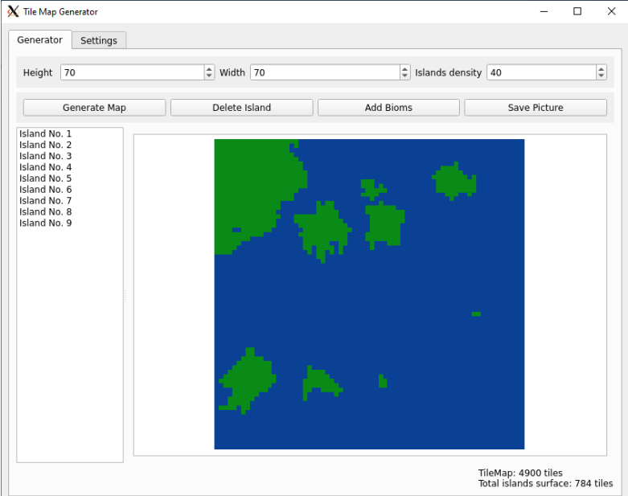

# TileMap-Generator (2D pixel map generator)
Tile Map generator project was done as an assigment for Python university course. 

# Table of contents

- [Requirements](#requirements)
- [Description](#Description)
- [Possible future improvements](#possible-future-improvements)
- [Screenshots](#screenshots)

# Requirements
Project is ought to be build in *Python3*, it requires *PySide2*, *PyTest*, *Numpy* and *Pillow* installed to run properly.

To sart the app you need to run ```gui.py``` file.

# Description
The project allows user to generate 2D pixel maps according to applied parameters:
- Height (in pixels) 
- Width (in pixels)
- Islands Density (percentage) - determines how much area of whole map would be taken by islands.
- Water RGB code - changes water colour.
- Island RGB code - changes basic island colour.

Moreover UI allows to add *bioms* to island, change the minimum island size to create biom on it, add new bioms, delete existing bioms and delete exisintg islands.
Parameters of every island can be displayed after clicking on it.

You can zoom in/out map using scroll.

After generating satisfying map you can save it to desired format by clicking *Save Picture*.

# Screenshots
<p align="center" width="100%">

<br>

